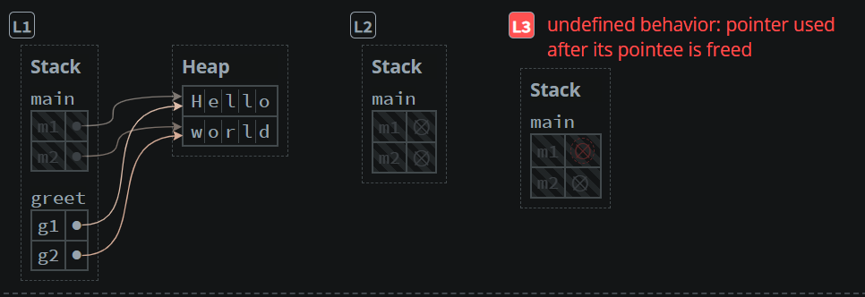

# [Example-1](src/main.rs)
- Representing concept of ownership and borrowing, along with vulnerability of using variables after they are moved.
- The value of variables **m1** and **m2** are moved into the params of **greet function**, hence greet taking their ownership.
```rust
let s = format!("{} {}", m1, m2);
```
- They cant be used in main now, Hence causing undefined behavior.


---
## [Example-2](src/main.rs)
- ***References** are non-owning pointers, because they do not own the data they point to.*
- **&** is used to create a reference.
- **&mut** is used to create a mutable reference.
- **m1** and **m2** are passed as references to **greet** function, hence they are not moved and can be used in main after greet function call.
- **greet** function takes **&String** as parameter, which is a reference to a String.
```bash
// OUTPUT
PS F:\Users\devke\Documents\rust-projects\memory-managment\ref_n_bor> cargo run
   Compiling ref_n_bor v0.1.0 (F:\Users\devke\Documents\rust-projects\memory-managment\ref_n_bor)
    Finished dev [unoptimized + debuginfo] target(s) in 3.47s
     Running `target\debug\ref_n_bor.exe`
Hello world!
```